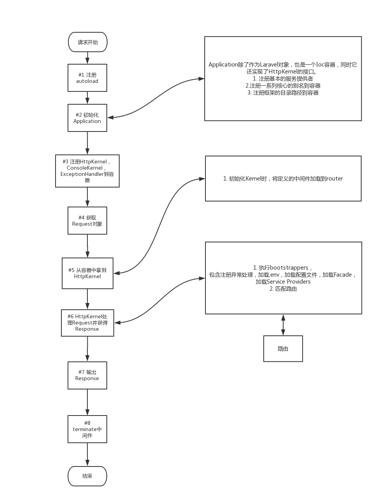

# Laravel源码分析-一个请求的生命周期

> 今天写下Laravel源码分析的第一篇，Laravel中一个完整的http请求的生命周期。虽然网络上很多Laravel的源码分析文章，但是还是要自己来写才能体会的更多，文章中会夹杂着讲解一些重要的概念，废话少说，正文开始。 

> 先讨论下 一个php框架必不可缺的组成部分：
> autoloader
> exceptionHandler、errorHandler和shutdownHandler
> Ioc容器（现代php框架必备）
> Router

