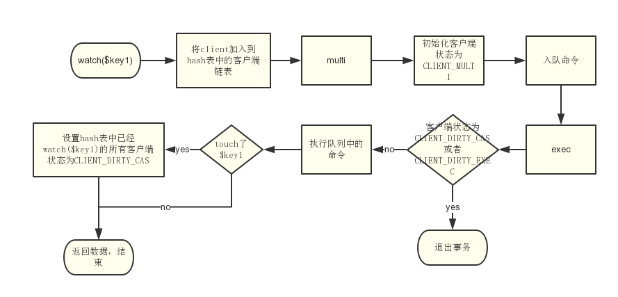

# Redis watch机制的分析

我们常用redis的watch和multi来处理一些涉及并发的操作，redis的watch+multi实际是一种乐观锁，今天我们来分析一下它的实现机制。

常用的代码段

```php
$key = 'xxxx';
$redis->watch($key);
$redis->multi();
// 更新了key
$redis->set($key);
$flag = $redis->exec();

// 如果事务执行失败返回false
if ($flag === false) {
    
} else {
    
}
```
## 流程图



当客户端A和客户端B同时执行这段代码时候，因为事务的执行是串行的，假设A客户端先于B执行，那么当A执行完成时，会将客户端A从watch了这个key的列表中删除，并且将列表中的所有客户端都设置为CLIENT_DIRTY_CAS，之后当B执行的时候，事务发现B的状态是CLIENT_DIRTY_CAS，便终止事务并返回失败。

***注意：只要watch的key被touch了，不管值变不变，都会导致其他客户端事务失败。***

## 存储

1. redis 用了哈希表+链表存储watch了key的客户端：


哈希表key为redis的key，哈希表的value为客户端组成的链表

定位key的复杂度O(1)，查找和处理客户端的复杂度为O(n)

Key1 => (client1->client2->client3...)

Key2 => (client1->client2->client3...)

2. 每个客户端也维护一个链表用来存储已经watch的key

## 相关源码

涉及文件

multi.h

multi.c

db.c

t_string.c

### watch

```c
/* watch命令 */
void watchCommand(client *c) {
    int j;

    if (c->flags & CLIENT_MULTI) {
        addReplyError(c,"WATCH inside MULTI is not allowed");
        return;
    }
    for (j = 1; j < c->argc; j++)
        watchForKey(c,c->argv[j]);
    addReply(c,shared.ok);
}

typedef struct watchedKey {
    robj *key;
    redisDb *db;
} watchedKey;

/* watch一个key */
void watchForKey(client *c, robj *key) {
    list *clients = NULL;
    listIter li;
    listNode *ln;
    watchedKey *wk;

    /* 检查key是否已经watch 如果已经watch 直接返回 */
    // 创建一个迭代器
    listRewind(c->watched_keys,&li);
    // 遍历客户端已经watch的key
    while((ln = listNext(&li))) {
        wk = listNodeValue(ln);
        // 当发现已经存在次key，直接返回
        if (wk->db == c->db && equalStringObjects(key,wk->key))
            return; /* Key already watched */
    }
    /* 没有被watch，继续一下处理 */
    // 获取hash表中当前key的客户端链表
    clients = dictFetchValue(c->db->watched_keys,key);
    // 如果不存在，则创建一个链表用于存储
    if (!clients) {
        clients = listCreate();
        dictAdd(c->db->watched_keys,key,clients);
        incrRefCount(key);
    }
    // 添加当前客户端到链表末尾
    listAddNodeTail(clients,c);
    /* 维护客户端中的watch_keys 链表 */
    wk = zmalloc(sizeof(*wk));
    wk->key = key;
    wk->db = c->db;
    incrRefCount(key);
    listAddNodeTail(c->watched_keys,wk);
}
```


### multi

```c
/* multi 命令 */
void multiCommand(client *c) {
    // 如果已经初始化了客户端状态，即已经执行了multi 则返回
    if (c->flags & CLIENT_MULTI) {
        addReplyError(c,"MULTI calls can not be nested");
        return;
    }
    // 初始化客户端状态为CLIENT_MULTI
    c->flags |= CLIENT_MULTI;
    addReply(c,shared.ok);
}

/* 初始化客户端状态 清空事务日志队列 */
void initClientMultiState(client *c) {
    c->mstate.commands = NULL;
    c->mstate.count = 0;
}
```


### exec

```c
/* exec 命令 */
void execCommand(client *c) {
    int j;
    robj **orig_argv;
    int orig_argc;
    struct redisCommand *orig_cmd;
    int must_propagate = 0; /* Need to propagate MULTI/EXEC to AOF / slaves? */
    int was_master = server.masterhost == NULL;
	
    // 未执行multi，则返回
    if (!(c->flags & CLIENT_MULTI)) {
        addReplyError(c,"EXEC without MULTI");
        return;
    }
	
    /*
     * 关键
     * 处理客户端状态 以下两种状态会直接终止事务，不会执行事务队列中的命令
     * 1. CLIENT_DIRTY_CAS => 当因为watch的key被touch了
     * 2. CLIENT_DIRTY_EXEC => 当客户端入队了不存在的命令
     */
    
    /* Check if we need to abort the EXEC because:
     * 1) Some WATCHed key was touched.
     * 2) There was a previous error while queueing commands.
     * A failed EXEC in the first case returns a multi bulk nil object
     * (technically it is not an error but a special behavior), while
     * in the second an EXECABORT error is returned. */
    if (c->flags & (CLIENT_DIRTY_CAS|CLIENT_DIRTY_EXEC)) {
        addReply(c, c->flags & CLIENT_DIRTY_EXEC ? shared.execaborterr :
                                                  shared.nullmultibulk);
        // 
        discardTransaction(c);
        goto handle_monitor;
    }

    /* 执行队列中的命令 */
    // 清空当前客户端中存储的watch了的key，和hash表中客户端node
    unwatchAllKeys(c); /* Unwatch ASAP otherwise we'll waste CPU cycles */
    orig_argv = c->argv;
    orig_argc = c->argc;
    orig_cmd = c->cmd;
    addReplyMultiBulkLen(c,c->mstate.count);
    // 执行队列中的命令
    for (j = 0; j < c->mstate.count; j++) {
        c->argc = c->mstate.commands[j].argc;
        c->argv = c->mstate.commands[j].argv;
        c->cmd = c->mstate.commands[j].cmd;

        /* Propagate a MULTI request once we encounter the first command which
         * is not readonly nor an administrative one.
         * This way we'll deliver the MULTI/..../EXEC block as a whole and
         * both the AOF and the replication link will have the same consistency
         * and atomicity guarantees. */
        if (!must_propagate && !(c->cmd->flags & (CMD_READONLY|CMD_ADMIN))) {
            execCommandPropagateMulti(c);
            must_propagate = 1;
        }
		// 这里会call相关的命令
        // 如果是涉及到修改相关的命令，不管有没有更改值，都会将hash表中watch了key的客户端的状态置为CLIENT_DIRTY_CAS
        call(c,CMD_CALL_FULL);

        /* Commands may alter argc/argv, restore mstate. */
        c->mstate.commands[j].argc = c->argc;
        c->mstate.commands[j].argv = c->argv;
        c->mstate.commands[j].cmd = c->cmd;
    }
    c->argv = orig_argv;
    c->argc = orig_argc;
    c->cmd = orig_cmd;
    discardTransaction(c);

    /* Make sure the EXEC command will be propagated as well if MULTI
     * was already propagated. */
    if (must_propagate) {
        int is_master = server.masterhost == NULL;
        server.dirty++;
        /* If inside the MULTI/EXEC block this instance was suddenly
         * switched from master to slave (using the SLAVEOF command), the
         * initial MULTI was propagated into the replication backlog, but the
         * rest was not. We need to make sure to at least terminate the
         * backlog with the final EXEC. */
        if (server.repl_backlog && was_master && !is_master) {
            char *execcmd = "*1\r\n$4\r\nEXEC\r\n";
            feedReplicationBacklog(execcmd,strlen(execcmd));
        }
    }

handle_monitor:
    /* Send EXEC to clients waiting data from MONITOR. We do it here
     * since the natural order of commands execution is actually:
     * MUTLI, EXEC, ... commands inside transaction ...
     * Instead EXEC is flagged as CMD_SKIP_MONITOR in the command
     * table, and we do it here with correct ordering. */
    if (listLength(server.monitors) && !server.loading)
        replicationFeedMonitors(c,server.monitors,c->db->id,c->argv,c->argc);
}

/* 清空当前事务数据 */
void discardTransaction(client *c) {
    freeClientMultiState(c);
    initClientMultiState(c);
    c->flags &= ~(CLIENT_MULTI|CLIENT_DIRTY_CAS|CLIENT_DIRTY_EXEC);
    unwatchAllKeys(c);
}

/* Unwatch all the keys watched by this client. To clean the EXEC dirty
 * flag is up to the caller. */
void unwatchAllKeys(client *c) {
    listIter li;
    listNode *ln;

    if (listLength(c->watched_keys) == 0) return;
    listRewind(c->watched_keys,&li);
    while((ln = listNext(&li))) {
        list *clients;
        watchedKey *wk;

        /* Lookup the watched key -> clients list and remove the client
         * from the list */
        wk = listNodeValue(ln);
        clients = dictFetchValue(wk->db->watched_keys, wk->key);
        serverAssertWithInfo(c,NULL,clients != NULL);
        listDelNode(clients,listSearchKey(clients,c));
        /* Kill the entry at all if this was the only client */
        if (listLength(clients) == 0)
            dictDelete(wk->db->watched_keys, wk->key);
        /* Remove this watched key from the client->watched list */
        listDelNode(c->watched_keys,ln);
        decrRefCount(wk->key);
        zfree(wk);
    }
}
```


### set,hset 以set命令为🌰

```c
void setGenericCommand(client *c, int flags, robj *key, robj *val, robj *expire, int unit, robj *ok_reply, robj *abort_reply) {
    long long milliseconds = 0; /* initialized to avoid any harmness warning */

    if (expire) {
        if (getLongLongFromObjectOrReply(c, expire, &milliseconds, NULL) != C_OK)
            return;
        if (milliseconds <= 0) {
            addReplyErrorFormat(c,"invalid expire time in %s",c->cmd->name);
            return;
        }
        if (unit == UNIT_SECONDS) milliseconds *= 1000;
    }

    if ((flags & OBJ_SET_NX && lookupKeyWrite(c->db,key) != NULL) ||
        (flags & OBJ_SET_XX && lookupKeyWrite(c->db,key) == NULL))
    {
        addReply(c, abort_reply ? abort_reply : shared.nullbulk);
        return;
    }
    // 看这里👀 设置string的值
    setKey(c->db,key,val);
    server.dirty++;
    if (expire) setExpire(c,c->db,key,mstime()+milliseconds);
    notifyKeyspaceEvent(NOTIFY_STRING,"set",key,c->db->id);
    if (expire) notifyKeyspaceEvent(NOTIFY_GENERIC,
        "expire",key,c->db->id);
    addReply(c, ok_reply ? ok_reply : shared.ok);
}

/* SET key value [NX] [XX] [EX <seconds>] [PX <milliseconds>] */
void setCommand(client *c) {
    int j;
    robj *expire = NULL;
    int unit = UNIT_SECONDS;
    int flags = OBJ_SET_NO_FLAGS;

    for (j = 3; j < c->argc; j++) {
        char *a = c->argv[j]->ptr;
        robj *next = (j == c->argc-1) ? NULL : c->argv[j+1];

        if ((a[0] == 'n' || a[0] == 'N') &&
            (a[1] == 'x' || a[1] == 'X') && a[2] == '\0' &&
            !(flags & OBJ_SET_XX))
        {
            flags |= OBJ_SET_NX;
        } else if ((a[0] == 'x' || a[0] == 'X') &&
                   (a[1] == 'x' || a[1] == 'X') && a[2] == '\0' &&
                   !(flags & OBJ_SET_NX))
        {
            flags |= OBJ_SET_XX;
        } else if ((a[0] == 'e' || a[0] == 'E') &&
                   (a[1] == 'x' || a[1] == 'X') && a[2] == '\0' &&
                   !(flags & OBJ_SET_PX) && next)
        {
            flags |= OBJ_SET_EX;
            unit = UNIT_SECONDS;
            expire = next;
            j++;
        } else if ((a[0] == 'p' || a[0] == 'P') &&
                   (a[1] == 'x' || a[1] == 'X') && a[2] == '\0' &&
                   !(flags & OBJ_SET_EX) && next)
        {
            flags |= OBJ_SET_PX;
            unit = UNIT_MILLISECONDS;
            expire = next;
            j++;
        } else {
            addReply(c,shared.syntaxerr);
            return;
        }
    }

    c->argv[2] = tryObjectEncoding(c->argv[2]);
    setGenericCommand(c,flags,c->argv[1],c->argv[2],expire,unit,NULL,NULL);
}

/* High level Set operation. This function can be used in order to set
 * a key, whatever it was existing or not, to a new object.
 *
 * 1) The ref count of the value object is incremented.
 * 2) clients WATCHing for the destination key notified.
 * 3) The expire time of the key is reset (the key is made persistent).
 *
 * All the new keys in the database should be craeted via this interface. */
void setKey(redisDb *db, robj *key, robj *val) {
    if (lookupKeyWrite(db,key) == NULL) {
        dbAdd(db,key,val);
    } else {
        dbOverwrite(db,key,val);
    }
    incrRefCount(val);
    removeExpire(db,key);
    // 看这里👀 标记hash表中所有已经watch这个key的所有客户端状态为CLIENT_DIRTY_CAS
    // 如果我原先的值为1，这里set为1，也会执行这个方法。所以说和值变没变没关系。
    signalModifiedKey(db,key);
}

void signalModifiedKey(redisDb *db, robj *key) {
    touchWatchedKey(db,key);
}

/* 更新hash表中相应客户端的状态为CLIENT_DIRTY_CAS */
void touchWatchedKey(redisDb *db, robj *key) {
    list *clients;
    listIter li;
    listNode *ln;

    if (dictSize(db->watched_keys) == 0) return;
    clients = dictFetchValue(db->watched_keys, key);
    if (!clients) return;

    /* Mark all the clients watching this key as CLIENT_DIRTY_CAS */
    /* Check if we are already watching for this key */
    listRewind(clients,&li);
    while((ln = listNext(&li))) {
        client *c = listNodeValue(ln);

        c->flags |= CLIENT_DIRTY_CAS;
    }
}
```